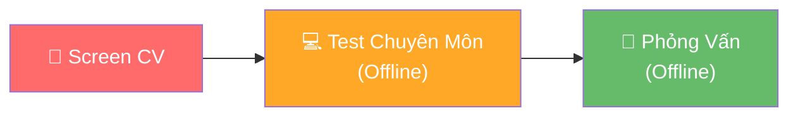

# 📋 Phân Tích JD: Thực Tập Sinh Backend Developer (PHP)

## 1. Tổng Quan Vị Trí

| Tiêu chí | Chi tiết |
|---|---|
| **Vị trí** | Thực tập sinh Backend Developer |
| **Ngôn ngữ chính** | PHP (Laravel, CodeIgniter) |
| **Mức trợ cấp** | 100,000 VND/ngày (~2-2.5tr/tháng) |
| **Thời gian** | 3-5 ngày/tuần, linh động theo lịch học |
| **Cơ hội chính thức** | Ký HĐLĐ sau 2 tháng nếu đủ năng lực, **không qua thử việc** |
| **Địa điểm** | Tầng 12, An Phú Plaza, 117-119 Lý Chính Thắng, Q3, HCM |
| **Hạn nộp** | 31/05/2026 |

---

## 2. Phân Tích Yêu Cầu — Ma Trận Kỹ Năng

### 🔴 Kỹ năng BẮT BUỘC (Must-have)

| Kỹ năng | Mức độ yêu cầu | Đánh giá bạn (dựa trên history) |
|---|---|---|
| PHP cơ bản + OOP | Nắm vững | ✅ **Rất tốt** — Dự án Pharmacy, IMMEETING |
| SQL Query | Nắm vững | ✅ **Rất tốt** — Schema design, complex queries |
| Lập trình Web | Hiểu biết cơ bản | ✅ **Tốt** |
| Làm việc nhóm | Soft skill | ✅ Có kinh nghiệm dự án nhóm |
| Tư duy logic | Mindset | ✅ Thể hiện qua kiến trúc RBAC, Clean Architecture |

### 🟡 Kỹ năng LỢI THẾ (Nice-to-have) — **Đây là nơi bạn cần TỎA SÁNG**

| Kỹ năng | Đánh giá bạn | Ghi chú |
|---|---|---|
| PHP Framework (Laravel) | ✅ **Xuất sắc** — RBAC module, Auth system | **Điểm mạnh nhất** |
| MySQL | ✅ **Tốt** — Database design kinh nghiệm | |
| JS Framework (VueJS/ReactJS) | ✅ **Tốt** — React Native (AI Storyboard) | |
| Docker | ✅ **Tốt** — Docker workflow optimization | **Bonus không có trong JD** |
| Kinh nghiệm dự án thực tế | ✅ **Có** — Pharmacy Management System | **Lợi thế cạnh tranh lớn** |

> [!TIP]
> **Nhận định:** Bạn đã vượt xa yêu cầu của JD. Vấn đề không phải là "đủ năng lực" mà là **cách trình bày** để nhà tuyển dụng thấy ngay giá trị.

---

## 3. Phân Tích Quy Trình Tuyển Dụng



### Chiến lược cho từng vòng:

| Vòng | Trọng tâm | Chiến lược |
|---|---|---|
| **Screen CV** | Portfolio + GitHub | Cần có 1-2 dự án **demo được**, README chuyên nghiệp |
| **Test chuyên môn** | PHP/OOP/SQL | Ôn luyện Design Patterns, Laravel fundamentals, SQL optimization |
| **Phỏng vấn** | Culture fit + kỹ thuật | Thể hiện đam mê, khả năng học hỏi, mindset làm việc với team Nhật |

> [!IMPORTANT]
> **Đặc điểm công ty Nhật:** Họ coi trọng **quy trình**, **code sạch**, **documentation**, và **tinh thần học hỏi** hơn là "code giỏi". Dự án của bạn cần thể hiện những yếu tố này.

---

## 4. 🚀 Dự Án Đề Xuất

### Dự án 1: **Task Management System** (Trello Clone đơn giản)

> **Lý do chọn:** Thể hiện toàn bộ kỹ năng trong JD + phù hợp văn hóa công ty Nhật (quản lý công việc có quy trình).

#### Tech Stack
| Layer | Công nghệ |
|---|---|
| Backend | **PHP 8.2 + Laravel 11** |
| Frontend | **Vue.js 3** (hoặc Blade + Alpine.js) |
| Database | **MySQL 8** |
| DevOps | **Docker + Docker Compose** |
| Auth | **Laravel Sanctum** (API Token) |

#### Tính năng cốt lõi

```
📦 Task Management System
├── 🔐 Authentication
│   ├── Đăng ký / Đăng nhập
│   ├── Forgot Password (Email)
│   └── Profile Management
│
├── 📋 Project Management
│   ├── CRUD Projects
│   ├── Invite Members (Role: Owner, Member, Viewer)
│   └── Project Dashboard với thống kê
│
├── ✅ Task Management  
│   ├── CRUD Tasks với Kanban Board (To Do → In Progress → Review → Done)
│   ├── Assign task cho member
│   ├── Priority levels (Low, Medium, High, Urgent)
│   ├── Due date + Notification
│   ├── Comments trên task
│   └── File attachments
│
├── 📊 Reporting
│   ├── Task completion rate (Chart.js)
│   ├── Member productivity
│   └── Export báo cáo PDF
│
└── ⚙️ System
    ├── Activity Log (ai làm gì, khi nào)
    ├── Search & Filter nâng cao
    └── RESTful API documentation (Swagger)
```

#### Điểm ghi điểm với nhà tuyển dụng

| Yếu tố | Cách thể hiện |
|---|---|
| **OOP** | Repository Pattern, Service Layer, Form Request Validation |
| **Database** | Migration, Seeder, Eloquent Relationships (Many-to-Many, Polymorphic) |
| **SQL** | Complex queries cho reporting, Query optimization với Eager Loading |
| **Clean Code** | PSR-12, PHPDoc, meaningful naming |
| **Quy trình** | Git Flow, Conventional Commits, PR description |
| **Văn hóa Nhật** | README song ngữ (Việt + English), API documentation chuẩn |

#### Database Schema gợi ý

```sql
-- Core tables
users (id, name, email, password, avatar, ...)
projects (id, name, description, owner_id, status, ...)
project_members (project_id, user_id, role, joined_at)
tasks (id, project_id, title, description, status, priority, 
       assignee_id, reporter_id, due_date, position, ...)
comments (id, task_id, user_id, content, ...)
attachments (id, attachable_type, attachable_id, file_path, ...)
activity_logs (id, user_id, loggable_type, loggable_id, action, ...)
```

---

### Dự án 2: **REST API — Mini E-Commerce Backend** (API-Only)

> **Lý do chọn:** Thể hiện khả năng xây dựng API chuẩn — kỹ năng core khi làm việc với team Nhật (backend VN, frontend Nhật hoặc ngược lại).

#### Tech Stack
| Layer | Công nghệ |
|---|---|
| Backend | **PHP 8.2 + Laravel 11** (API-only) |
| Database | **MySQL 8** |
| Cache | **Redis** (optional) |
| Testing | **PHPUnit + Pest** |
| Docs | **Swagger / Scribe** |

#### Tính năng cốt lõi

```
📦 E-Commerce API
├── 🔐 Auth (Sanctum)
│   ├── Register / Login / Logout
│   └── Role-based: Admin, Customer
│
├── 🏪 Product Management (Admin)
│   ├── CRUD Products với Categories
│   ├── Product variants (size, color)
│   ├── Image upload (Local/S3)
│   └── Inventory tracking
│
├── 🛒 Shopping Flow (Customer)
│   ├── Cart management
│   ├── Checkout process
│   ├── Order history
│   └── Order status tracking
│
├── 📊 Admin Dashboard API
│   ├── Revenue statistics
│   ├── Top selling products  
│   ├── Order analytics
│   └── Customer insights
│
└── ⚙️ Infrastructure
    ├── API Rate Limiting
    ├── Request Validation (Form Request)
    ├── Error Handling (Global Exception Handler)
    ├── API Versioning (v1/)
    ├── Pagination + Filtering + Sorting
    └── Unit + Feature Tests (>80% coverage)
```

#### Điểm ghi điểm với nhà tuyển dụng

| Yếu tố | Cách thể hiện |
|---|---|
| **API Design** | RESTful conventions, proper HTTP status codes, consistent response format |
| **Testing** | Unit tests + Feature tests, TDD approach |
| **Security** | Input validation, SQL injection prevention, CORS, Rate limiting |
| **Performance** | Eager loading, Database indexing, Query caching |
| **Documentation** | Swagger UI, Postman Collection, README chuẩn |
| **DevOps** | Docker setup, CI/CD pipeline (GitHub Actions) |

---

## 5. 🎯 Khuyến Nghị Chiến Lược

### Nên chọn dự án nào?

> [!IMPORTANT]
> **Khuyến nghị:** Làm **cả 2 dự án**, nhưng với mức độ ưu tiên khác nhau:
> 
> | Ưu tiên | Dự án | Thời gian | Lý do |
> |---|---|---|---|
> | 🥇 **Chính** | Task Management | 2-3 tuần | Full-stack, demo trực quan, thể hiện nhiều kỹ năng |
> | 🥈 **Phụ** | E-Commerce API | 1-2 tuần | Thể hiện depth về API + Testing |

### Checklist trước khi nộp CV

- [ ] **GitHub Profile** sạch đẹp, có pinned repos
- [ ] **README** mỗi dự án có: screenshots/GIF demo, tech stack badges, hướng dẫn cài đặt
- [ ] **Code quality**: consistent coding style, meaningful commits
- [ ] **Live demo** (deploy lên server miễn phí nếu có thể)
- [ ] **CV** highlight: dự án thực tế (Pharmacy System), kiến thức RBAC/Auth, Docker

### Timeline đề xuất (bạn có ~6 tuần đến hạn 31/05)

```
Tuần 1-2: Dự án 1 - Task Management (Core features)
Tuần 3:   Dự án 1 - Polish + Deploy  
Tuần 4-5: Dự án 2 - E-Commerce API
Tuần 6:   Chuẩn bị CV + Ôn tập PHP/SQL cho vòng test
```

> [!TIP]
> **Pro tip cho công ty Nhật:** Thêm một file `CONTRIBUTING.md` và viết commit messages có format chuẩn (ví dụ: `feat: add task assignment feature`). Người Nhật rất ấn tượng với developer có **quy trình làm việc chuyên nghiệp**.
