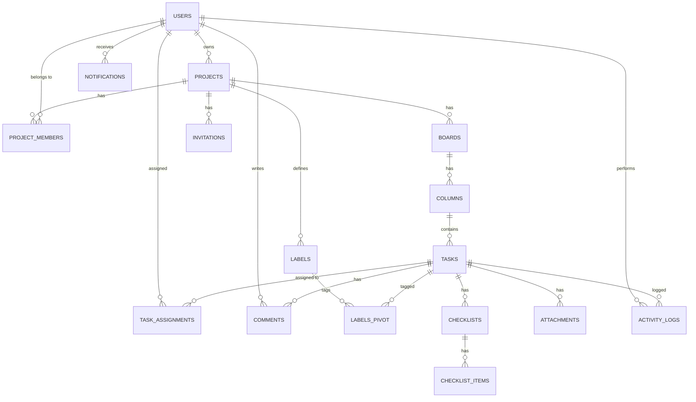

# 🚀 ProFlow — Advanced Task & Project Management System

> **Codename:** ProFlow | **Type:** Full-stack Web Application | **Purpose:** Portfolio Showcase Project
> **Target:** Chinh phục vị trí Backend Developer Intern tại công ty phần mềm Nhật Bản

---

## 📌 MỤC TIÊU DỰ ÁN (Project Objectives)

### Mục tiêu chính: Chinh phục nhà tuyển dụng

Dự án này được xây dựng với mục tiêu **chứng minh năng lực kỹ thuật** vượt xa mức thực tập sinh, cụ thể:

| # | Yêu cầu từ JD | Cách dự án chứng minh | Mức độ |
|---|---|---|---|
| 1 | PHP + OOP | Repository Pattern, Service Layer, DTOs, Enums, Interfaces | ⭐⭐⭐ |
| 2 | PHP Framework (Laravel) | Laravel 11 với kiến trúc enterprise-grade | ⭐⭐⭐ |
| 3 | Database / SQL Query | Complex Eloquent, Raw SQL reporting, Migration, Seeder, Indexing | ⭐⭐⭐ |
| 4 | Frontend (VueJS/ReactJS) | React 19 + Hooks, Zustand, Drag & Drop interactivity | ⭐⭐⭐ |
| 5 | Làm việc nhóm | Git Flow, Conventional Commits, PR templates, CONTRIBUTING.md | ⭐⭐⭐ |
| 6 | Tư duy logic, sáng tạo | Event-Driven Architecture, Real-time WebSocket, Queue system | ⭐⭐⭐ |

### Mục tiêu phụ: Thể hiện mindset công ty Nhật

- **Quy trình rõ ràng:** Commit history sạch, documentation đầy đủ
- **Code sạch:** PSR-12, PHPDoc, SOLID principles, DRY
- **Traceability:** Activity Log ghi lại mọi hành động — audit trail hoàn chỉnh
- **Documentation:** README song ngữ (Việt + English), API docs (Swagger/Scribe)

---

## 🏗️ KIẾN TRÚC HỆ THỐNG (System Architecture)

### Tech Stack

| Layer | Công nghệ | Phiên bản | Lý do chọn |
|---|---|---|---|
| **Backend** | PHP + Laravel | 8.2+ / 11.x | Framework #1 về ecosystem, JD yêu cầu |
| **Frontend** | Vue.js 3 | 3.4+ | JD yêu cầu, Composition API hiện đại |
| **State Management** | Zustand | 5.x | Lightweight state manager for React |
| **Database** | MySQL | 8.0+ | JD yêu cầu, production-ready |
| **Cache & Queue** | Redis | 7.x | Real-time, queue jobs, session, cache |
| **Real-time** | Laravel Reverb | 1.x | WebSocket native Laravel, zero-dependency |
| **Search** | Laravel Scout + TNTSearch | — | Full-text search không cần Elasticsearch |
| **File Storage** | Laravel Storage | — | Local + S3-compatible |
| **Auth** | Laravel Sanctum | 4.x | SPA authentication, API tokens |
| **API Docs** | Scribe | 4.x | Auto-generate API documentation |
| **Testing** | Pest PHP | 2.x | Modern PHP testing framework |
| **DevOps** | Docker + Docker Compose | — | Containerized development |
| **CI/CD** | GitHub Actions | — | Automated testing & deployment |
| **Code Quality** | Laravel Pint + PHPStan | — | Linting + Static analysis |

### Architecture Pattern

```
┌─────────────────────────────────────────────────────────┐
│                    Vue.js 3 SPA (Frontend)              │
│ ┌─────────┐ ┌──────────┐ ┌──────────┐ ┌─────────────┐  │
│ │ Router  │ │ Zustand  │ │  Hooks    │ │ Components  │  │
│ └────┬────┘ └────┬─────┘ └────┬─────┘ └──────┬──────┘  │
│      └───────────┴────────────┴──────────────┘          │
│                         │ Axios HTTP + Echo WebSocket    │
├─────────────────────────┼───────────────────────────────┤
│                    Laravel 11 (Backend)                  │
│                         │                                │
│  ┌──────────────────────┼────────────────────────────┐  │
│  │              API Layer (Controllers)               │  │
│  │  ┌─────────┐  ┌──────────┐  ┌──────────────────┐  │  │
│  │  │ FormReq │  │ Resource │  │ API Response Trait│  │  │
│  │  └────┬────┘  └────┬─────┘  └────────┬─────────┘  │  │
│  ├───────┼────────────┼─────────────────┼────────────┤  │
│  │              Service Layer (Business Logic)        │  │
│  │  ┌──────────┐  ┌──────────┐  ┌───────────────┐    │  │
│  │  │ Services │  │   DTOs   │  │ Action Classes│    │  │
│  │  └────┬─────┘  └──────────┘  └───────┬───────┘    │  │
│  ├───────┼──────────────────────────────┼────────────┤  │
│  │              Domain Layer (Models & Events)        │  │
│  │  ┌────────┐ ┌────────┐ ┌────────┐ ┌──────────┐    │  │
│  │  │ Models │ │ Enums  │ │ Events │ │Listeners │    │  │
│  │  └───┬────┘ └────────┘ └────────┘ └──────────┘    │  │
│  ├──────┼────────────────────────────────────────────┤  │
│  │              Infrastructure Layer                  │  │
│  │  ┌────────────┐ ┌───────┐ ┌──────┐ ┌───────────┐  │  │
│  │  │Repositories│ │ Cache │ │Queue │ │ Broadcast │  │  │
│  │  └─────┬──────┘ └───┬───┘ └──┬───┘ └─────┬─────┘  │  │
│  └────────┼─────────────┼───────┼───────────┼────────┘  │
│           │             │       │           │            │
├───────────┼─────────────┼───────┼───────────┼───────────┤
│   ┌───────┴──┐    ┌─────┴──┐ ┌──┴────┐  ┌──┴────────┐  │
│   │  MySQL   │    │ Redis  │ │ Redis │  │  Reverb   │  │
│   │ Database │    │ Cache  │ │ Queue │  │ WebSocket │  │
│   └──────────┘    └────────┘ └───────┘  └───────────┘  │
└─────────────────────────────────────────────────────────┘
```

### Design Patterns Sử Dụng

| Pattern | Áp dụng ở đâu | Thể hiện kỹ năng |
|---|---|---|
| **Repository Pattern** | Data access abstraction cho Models | OOP, SOLID (Dependency Inversion) |
| **Service Layer** | Business logic tách khỏi Controller | Single Responsibility, Testability |
| **DTO (Data Transfer Object)** | Transfer data giữa layers | Type safety, Clean code |
| **Action Classes** | Single-purpose business operations | Single Responsibility |
| **Observer Pattern** | Model events (tạo activity log) | Laravel Events, Decoupling |
| **Strategy Pattern** | Notification channels (Email, Database, Broadcast) | OOP Polymorphism |
| **Builder Pattern** | Complex query construction cho filters | Fluent API, Query optimization |
| **Factory Pattern** | Seeder + Testing data generation | Testing best practices |

---

## 📊 DATABASE SCHEMA

### Entity Relationship Diagram



### Chi Tiết Bảng

#### `users`
```sql
CREATE TABLE users (
    id              BIGINT UNSIGNED AUTO_INCREMENT PRIMARY KEY,
    name            VARCHAR(255) NOT NULL,
    email           VARCHAR(255) NOT NULL UNIQUE,
    email_verified_at TIMESTAMP NULL,
    password        VARCHAR(255) NOT NULL,
    avatar_path     VARCHAR(500) NULL,
    bio             TEXT NULL,
    timezone        VARCHAR(50) DEFAULT 'Asia/Ho_Chi_Minh',
    last_active_at  TIMESTAMP NULL,
    remember_token  VARCHAR(100) NULL,
    created_at      TIMESTAMP NULL,
    updated_at      TIMESTAMP NULL,
    
    INDEX idx_users_email (email),
    INDEX idx_users_last_active (last_active_at)
);
```

#### `projects`
```sql
CREATE TABLE projects (
    id              BIGINT UNSIGNED AUTO_INCREMENT PRIMARY KEY,
    name            VARCHAR(255) NOT NULL,
    description     TEXT NULL,
    owner_id        BIGINT UNSIGNED NOT NULL,
    visibility      ENUM('private', 'team', 'public') DEFAULT 'private',
    color           VARCHAR(7) DEFAULT '#6366f1',  -- HEX color
    icon            VARCHAR(50) DEFAULT 'folder',
    is_archived     BOOLEAN DEFAULT FALSE,
    archived_at     TIMESTAMP NULL,
    created_at      TIMESTAMP NULL,
    updated_at      TIMESTAMP NULL,
    
    FOREIGN KEY (owner_id) REFERENCES users(id) ON DELETE CASCADE,
    INDEX idx_projects_owner (owner_id),
    INDEX idx_projects_archived (is_archived)
);
```

#### `project_members`
```sql
CREATE TABLE project_members (
    id              BIGINT UNSIGNED AUTO_INCREMENT PRIMARY KEY,
    project_id      BIGINT UNSIGNED NOT NULL,
    user_id         BIGINT UNSIGNED NOT NULL,
    role            ENUM('owner', 'admin', 'member', 'viewer') DEFAULT 'member',
    joined_at       TIMESTAMP NOT NULL DEFAULT CURRENT_TIMESTAMP,
    created_at      TIMESTAMP NULL,
    updated_at      TIMESTAMP NULL,
    
    FOREIGN KEY (project_id) REFERENCES projects(id) ON DELETE CASCADE,
    FOREIGN KEY (user_id) REFERENCES users(id) ON DELETE CASCADE,
    UNIQUE KEY uniq_project_user (project_id, user_id),
    INDEX idx_pm_role (role)
);
```

#### `boards`
```sql
CREATE TABLE boards (
    id              BIGINT UNSIGNED AUTO_INCREMENT PRIMARY KEY,
    project_id      BIGINT UNSIGNED NOT NULL,
    name            VARCHAR(255) NOT NULL,
    description     TEXT NULL,
    position        INT UNSIGNED DEFAULT 0,
    is_default      BOOLEAN DEFAULT FALSE,
    created_at      TIMESTAMP NULL,
    updated_at      TIMESTAMP NULL,
    
    FOREIGN KEY (project_id) REFERENCES projects(id) ON DELETE CASCADE,
    INDEX idx_boards_project (project_id),
    INDEX idx_boards_position (position)
);
```

#### `columns` (Kanban Columns)
```sql
CREATE TABLE columns (
    id              BIGINT UNSIGNED AUTO_INCREMENT PRIMARY KEY,
    board_id        BIGINT UNSIGNED NOT NULL,
    name            VARCHAR(255) NOT NULL,
    color           VARCHAR(7) DEFAULT '#64748b',
    position        INT UNSIGNED DEFAULT 0,
    wip_limit       INT UNSIGNED NULL,           -- Work In Progress limit (tính năng nâng cao)
    is_done_column  BOOLEAN DEFAULT FALSE,       -- Đánh dấu column hoàn thành
    created_at      TIMESTAMP NULL,
    updated_at      TIMESTAMP NULL,

    FOREIGN KEY (board_id) REFERENCES boards(id) ON DELETE CASCADE,
    INDEX idx_columns_board (board_id),
    INDEX idx_columns_position (position)
);
```

#### `tasks`
```sql
CREATE TABLE tasks (
    id              BIGINT UNSIGNED AUTO_INCREMENT PRIMARY KEY,
    column_id       BIGINT UNSIGNED NOT NULL,
    project_id      BIGINT UNSIGNED NOT NULL,    -- Denormalized for query performance
    title           VARCHAR(500) NOT NULL,
    description     LONGTEXT NULL,               -- Markdown support
    position        INT UNSIGNED DEFAULT 0,
    priority        ENUM('low', 'medium', 'high', 'urgent') DEFAULT 'medium',
    type            ENUM('task', 'bug', 'feature', 'improvement') DEFAULT 'task',
    status          ENUM('open', 'in_progress', 'review', 'done', 'closed') DEFAULT 'open',
    reporter_id     BIGINT UNSIGNED NOT NULL,
    start_date      DATE NULL,
    due_date        DATE NULL,
    completed_at    TIMESTAMP NULL,
    estimated_hours DECIMAL(5,1) NULL,           -- Ước lượng thời gian
    actual_hours    DECIMAL(5,1) NULL,           -- Thời gian thực tế
    cover_image     VARCHAR(500) NULL,
    is_archived     BOOLEAN DEFAULT FALSE,
    created_at      TIMESTAMP NULL,
    updated_at      TIMESTAMP NULL,
    
    FOREIGN KEY (column_id) REFERENCES columns(id) ON DELETE CASCADE,
    FOREIGN KEY (project_id) REFERENCES projects(id) ON DELETE CASCADE,
    FOREIGN KEY (reporter_id) REFERENCES users(id) ON DELETE CASCADE,
    INDEX idx_tasks_column (column_id),
    INDEX idx_tasks_project (project_id),
    INDEX idx_tasks_status (status),
    INDEX idx_tasks_priority (priority),
    INDEX idx_tasks_due (due_date),
    INDEX idx_tasks_position (position),
    FULLTEXT INDEX ft_tasks_search (title, description)
);
```

#### `task_assignments`
```sql
CREATE TABLE task_assignments (
    id              BIGINT UNSIGNED AUTO_INCREMENT PRIMARY KEY,
    task_id         BIGINT UNSIGNED NOT NULL,
    user_id         BIGINT UNSIGNED NOT NULL,
    assigned_by     BIGINT UNSIGNED NOT NULL,
    assigned_at     TIMESTAMP NOT NULL DEFAULT CURRENT_TIMESTAMP,
    
    FOREIGN KEY (task_id) REFERENCES tasks(id) ON DELETE CASCADE,
    FOREIGN KEY (user_id) REFERENCES users(id) ON DELETE CASCADE,
    FOREIGN KEY (assigned_by) REFERENCES users(id) ON DELETE CASCADE,
    UNIQUE KEY uniq_task_user (task_id, user_id)
);
```

#### `labels`
```sql
CREATE TABLE labels (
    id              BIGINT UNSIGNED AUTO_INCREMENT PRIMARY KEY,
    project_id      BIGINT UNSIGNED NOT NULL,
    name            VARCHAR(100) NOT NULL,
    color           VARCHAR(7) NOT NULL DEFAULT '#6366f1',
    created_at      TIMESTAMP NULL,
    updated_at      TIMESTAMP NULL,
    
    FOREIGN KEY (project_id) REFERENCES projects(id) ON DELETE CASCADE,
    UNIQUE KEY uniq_label_project (project_id, name)
);
```

#### `task_labels` (Pivot)
```sql
CREATE TABLE task_labels (
    task_id         BIGINT UNSIGNED NOT NULL,
    label_id        BIGINT UNSIGNED NOT NULL,
    
    PRIMARY KEY (task_id, label_id),
    FOREIGN KEY (task_id) REFERENCES tasks(id) ON DELETE CASCADE,
    FOREIGN KEY (label_id) REFERENCES labels(id) ON DELETE CASCADE
);
```

#### `checklists`
```sql
CREATE TABLE checklists (
    id              BIGINT UNSIGNED AUTO_INCREMENT PRIMARY KEY,
    task_id         BIGINT UNSIGNED NOT NULL,
    title           VARCHAR(255) NOT NULL,
    position        INT UNSIGNED DEFAULT 0,
    created_at      TIMESTAMP NULL,
    updated_at      TIMESTAMP NULL,
    
    FOREIGN KEY (task_id) REFERENCES tasks(id) ON DELETE CASCADE
);
```

#### `checklist_items`
```sql
CREATE TABLE checklist_items (
    id              BIGINT UNSIGNED AUTO_INCREMENT PRIMARY KEY,
    checklist_id    BIGINT UNSIGNED NOT NULL,
    content         VARCHAR(500) NOT NULL,
    is_completed    BOOLEAN DEFAULT FALSE,
    completed_at    TIMESTAMP NULL,
    completed_by    BIGINT UNSIGNED NULL,
    position        INT UNSIGNED DEFAULT 0,
    created_at      TIMESTAMP NULL,
    updated_at      TIMESTAMP NULL,
    
    FOREIGN KEY (checklist_id) REFERENCES checklists(id) ON DELETE CASCADE,
    FOREIGN KEY (completed_by) REFERENCES users(id) ON DELETE SET NULL
);
```

#### `comments`
```sql
CREATE TABLE comments (
    id              BIGINT UNSIGNED AUTO_INCREMENT PRIMARY KEY,
    task_id         BIGINT UNSIGNED NOT NULL,
    user_id         BIGINT UNSIGNED NOT NULL,
    parent_id       BIGINT UNSIGNED NULL,        -- Threaded comments
    content         TEXT NOT NULL,                -- Markdown support
    is_edited       BOOLEAN DEFAULT FALSE,
    edited_at       TIMESTAMP NULL,
    created_at      TIMESTAMP NULL,
    updated_at      TIMESTAMP NULL,
    
    FOREIGN KEY (task_id) REFERENCES tasks(id) ON DELETE CASCADE,
    FOREIGN KEY (user_id) REFERENCES users(id) ON DELETE CASCADE,
    FOREIGN KEY (parent_id) REFERENCES comments(id) ON DELETE CASCADE,
    INDEX idx_comments_task (task_id),
    INDEX idx_comments_parent (parent_id)
);
```

#### `attachments` (Polymorphic)
```sql
CREATE TABLE attachments (
    id              BIGINT UNSIGNED AUTO_INCREMENT PRIMARY KEY,
    attachable_type VARCHAR(255) NOT NULL,        -- App\Models\Task, App\Models\Comment
    attachable_id   BIGINT UNSIGNED NOT NULL,
    user_id         BIGINT UNSIGNED NOT NULL,
    original_name   VARCHAR(500) NOT NULL,
    file_path       VARCHAR(500) NOT NULL,
    file_size       BIGINT UNSIGNED NOT NULL,     -- bytes
    mime_type       VARCHAR(100) NOT NULL,
    created_at      TIMESTAMP NULL,
    updated_at      TIMESTAMP NULL,
    
    FOREIGN KEY (user_id) REFERENCES users(id) ON DELETE CASCADE,
    INDEX idx_attachable (attachable_type, attachable_id)
);
```

#### `activity_logs`
```sql
CREATE TABLE activity_logs (
    id              BIGINT UNSIGNED AUTO_INCREMENT PRIMARY KEY,
    user_id         BIGINT UNSIGNED NULL,
    project_id      BIGINT UNSIGNED NOT NULL,
    loggable_type   VARCHAR(255) NOT NULL,        -- Polymorphic
    loggable_id     BIGINT UNSIGNED NOT NULL,
    action          VARCHAR(50) NOT NULL,          -- created, updated, deleted, moved, assigned, etc.
    changes         JSON NULL,                     -- {"old": {...}, "new": {...}}
    description     VARCHAR(500) NULL,             -- Human-readable description
    ip_address      VARCHAR(45) NULL,
    user_agent      VARCHAR(500) NULL,
    created_at      TIMESTAMP NULL,
    
    FOREIGN KEY (user_id) REFERENCES users(id) ON DELETE SET NULL,
    FOREIGN KEY (project_id) REFERENCES projects(id) ON DELETE CASCADE,
    INDEX idx_activity_project (project_id),
    INDEX idx_activity_loggable (loggable_type, loggable_id),
    INDEX idx_activity_created (created_at),
    INDEX idx_activity_action (action)
);
```

#### `notifications`
```sql
CREATE TABLE notifications (
    id              CHAR(36) PRIMARY KEY,         -- UUID
    type            VARCHAR(255) NOT NULL,
    notifiable_type VARCHAR(255) NOT NULL,
    notifiable_id   BIGINT UNSIGNED NOT NULL,
    data            JSON NOT NULL,
    read_at         TIMESTAMP NULL,
    created_at      TIMESTAMP NULL,
    updated_at      TIMESTAMP NULL,
    
    INDEX idx_notifiable (notifiable_type, notifiable_id),
    INDEX idx_notifications_read (read_at)
);
```

#### `invitations`
```sql
CREATE TABLE invitations (
    id              BIGINT UNSIGNED AUTO_INCREMENT PRIMARY KEY,
    project_id      BIGINT UNSIGNED NOT NULL,
    email           VARCHAR(255) NOT NULL,
    role            ENUM('admin', 'member', 'viewer') DEFAULT 'member',
    token           VARCHAR(64) NOT NULL UNIQUE,
    invited_by      BIGINT UNSIGNED NOT NULL,
    accepted_at     TIMESTAMP NULL,
    expires_at      TIMESTAMP NOT NULL,
    created_at      TIMESTAMP NULL,
    updated_at      TIMESTAMP NULL,
    
    FOREIGN KEY (project_id) REFERENCES projects(id) ON DELETE CASCADE,
    FOREIGN KEY (invited_by) REFERENCES users(id) ON DELETE CASCADE,
    INDEX idx_invitations_token (token),
    INDEX idx_invitations_email (email)
);
```

---

## 🎯 TÍNH NĂNG CHI TIẾT (Feature Specification)

### Epic 1: Authentication & User Management

> **Kỹ năng thể hiện:** Laravel Sanctum, Form Validation, Email, File Upload

| Feature | Mô tả | Priority |
|---|---|---|
| **Đăng ký** | Email + Password, email verification | P0 |
| **Đăng nhập** | Email/Password, Remember me, Sanctum SPA auth | P0 |
| **Đăng xuất** | Revoke current/all tokens | P0 |
| **Quên mật khẩu** | Reset via email link | P1 |
| **Quản lý Profile** | Update name, avatar (upload + crop), bio, timezone | P1 |
| **Đổi mật khẩu** | With current password confirmation | P1 |
| **Online Status** | Last active tracking, online indicator | P2 |

### Epic 2: Project Management

> **Kỹ năng thể hiện:** CRUD, Authorization (Policy), Relationships, Invitation system

| Feature | Mô tả | Priority |
|---|---|---|
| **CRUD Project** | Create, Read, Update, Delete với soft operations | P0 |
| **Project Dashboard** | Overview: stats, recent activity, charts | P0 |
| **Member Management** | Invite (email), Accept/Reject, Remove, Change role | P0 |
| **Role-Based Access** | Owner > Admin > Member > Viewer permissions | P0 |
| **Archive/Restore** | Soft archive projects thay vì xóa | P1 |
| **Project Settings** | Visibility, Color, Icon, Notifications preferences | P1 |
| **Star/Favorite** | Star projects for quick access | P2 |

### Epic 3: Board & Column Management (Kanban)

> **Kỹ năng thể hiện:** Drag & Drop, Position ordering, Real-time sync

| Feature | Mô tả | Priority |
|---|---|---|
| **Multi-Board** | Mỗi project có nhiều boards (Sprint Board, Bug Board) | P0 |
| **CRUD Columns** | Add, rename, reorder, delete columns | P0 |
| **Drag & Drop Columns** | Kéo thả thay đổi vị trí columns | P0 |
| **WIP Limit** | Giới hạn số task trong 1 column (Kanban best practice) | P1 |
| **Column Color** | Custom color cho mỗi column | P2 |
| **Done Column** | Đánh dấu column nào là "hoàn thành" | P1 |

### Epic 4: Task Management ⭐ (Core Feature)

> **Kỹ năng thể hiện:** Complex CRUD, Eloquent Relationships, Polymorphism, Full-text Search

| Feature | Mô tả | Priority |
|---|---|---|
| **CRUD Task** | Create with title → open modal for details | P0 |
| **Kanban Drag & Drop** | Kéo task giữa các columns, cập nhật position + status | P0 |
| **Task Detail Modal** | Full detail view: description (Markdown), metadata | P0 |
| **Task Assignment** | Assign/Unassign multiple members | P0 |
| **Priority** | Low / Medium / High / Urgent với visual indicators | P0 |
| **Task Type** | Task / Bug / Feature / Improvement với icons | P1 |
| **Due Date** | Date picker, overdue warning, color indicators | P0 |
| **Labels/Tags** | Create labels per project, multi-tag tasks | P1 |
| **Checklists** | Multi-checklist per task, progress percentage | P1 |
| **Cover Image** | Upload cover image cho task | P2 |
| **Time Tracking** | Estimated vs Actual hours | P1 |
| **Task Archive** | Archive thay vì xóa | P1 |
| **Bulk Actions** | Select multiple tasks → move, assign, delete, archive | P2 |

### Epic 5: Comments & Collaboration

> **Kỹ năng thể hiện:** Real-time (WebSocket), Threaded comments, Mentions, Markdown

| Feature | Mô tả | Priority |
|---|---|---|
| **Comments** | Add/Edit/Delete comments trên task | P0 |
| **Threaded Replies** | Reply to comments (1 level nesting) | P1 |
| **Markdown Support** | Comment content hỗ trợ Markdown | P1 |
| **@Mentions** | @username trong comment → notification | P2 |
| **Real-time Comments** | Comments xuất hiện real-time cho mọi người | P1 |
| **Comment Reactions** | 👍 👎 ❤️ 😄 reactions trên comment | P3 |

### Epic 6: File Attachments

> **Kỹ năng thể hiện:** File Upload, Polymorphic relationships, Storage abstraction

| Feature | Mô tả | Priority |
|---|---|---|
| **Upload Files** | Drag & Drop file upload trên task | P1 |
| **File Preview** | Preview images, PDFs inline | P2 |
| **Download** | Download file attachment | P1 |
| **Delete** | Remove file (chỉ uploader hoặc admin) | P1 |
| **Storage Config** | Local disk / S3-compatible (abstraction) | P2 |

### Epic 7: Notifications System ⭐ (Advanced Feature)

> **Kỹ năng thể hiện:** Laravel Notifications, Broadcasting (WebSocket), Queue Jobs

| Feature | Mô tả | Priority |
|---|---|---|
| **In-App Notifications** | Bell icon với unread counter, notification dropdown | P0 |
| **Real-time Push** | WebSocket broadcast khi có notification mới | P1 |
| **Email Notifications** | Gửi email cho critical events (assigned, mentioned, deadline) | P1 |
| **Mark as Read** | Mark individual / all as read | P0 |
| **Notification Preferences** | User chọn nhận notification cho event nào | P2 |

**Notification Events:**
- Task assigned to you
- Task moved to another column
- Comment on your task
- @Mentioned in a comment
- Task due date approaching (24h before)
- Invitation to project
- Task priority changed to Urgent

### Epic 8: Activity Log & Audit Trail ⭐ (Impressive Feature)

> **Kỹ năng thể hiện:** Observer Pattern, JSON storage, Timeline UI, Polymorphism

| Feature | Mô tả | Priority |
|---|---|---|
| **Auto Activity Logging** | Tự động ghi log mọi hành động trên project | P0 |
| **Activity Timeline** | UI timeline hiển thị activities theo thời gian | P0 |
| **Change Tracking** | Ghi lại old value → new value (JSON diff) | P1 |
| **Filter Activities** | Filter by user, action type, date range | P1 |
| **Project Activity Feed** | Activity feed trên project dashboard | P0 |

**Actions tracked:**
- `task.created`, `task.updated`, `task.moved`, `task.deleted`, `task.archived`
- `comment.created`, `comment.updated`, `comment.deleted`
- `member.invited`, `member.joined`, `member.removed`, `member.role_changed`
- `column.created`, `column.reordered`
- `attachment.uploaded`, `attachment.deleted`

### Epic 9: Search & Filtering ⭐ (Advanced Feature)

> **Kỹ năng thể hiện:** Full-text Search, Complex SQL Queries, Query Builder pattern

| Feature | Mô tả | Priority |
|---|---|---|
| **Global Search** | Search across tasks, projects, comments | P1 |
| **Task Filters** | Filter by: status, priority, assignee, label, type, date range | P0 |
| **Filter Combinations** | Combine multiple filters (AND logic) | P0 |
| **Save Filters** | Save frequently used filter combinations | P2 |
| **Sort Tasks** | Sort by: date, priority, due date, name | P1 |

### Epic 10: Dashboard & Analytics ⭐ (Impressive Feature)

> **Kỹ năng thể hiện:** Complex SQL/Eloquent queries, Aggregation, Chart.js, Data visualization

| Feature | Mô tả | Priority |
|---|---|---|
| **Personal Dashboard** | Overview tất cả projects, tasks assigned, due soon | P0 |
| **Project Analytics** | Task completion rate, velocity, burn-down approximation | P1 |
| **Member Productivity** | Tasks completed per member (bar chart) | P1 |
| **Priority Distribution** | Pie chart phân bổ tasks theo priority | P1 |
| **Due Date Calendar** | Calendar view hiển thị tasks theo due date | P2 |
| **Weekly Report** | Auto-generate weekly summary statistics | P2 |

### Epic 11: Real-time Collaboration ⭐⭐ (WOW Feature)

> **Kỹ năng thể hiện:** WebSocket (Laravel Reverb), Broadcasting, Presence channels

| Feature | Mô tả | Priority |
|---|---|---|
| **Live Kanban Board** | Khi 1 người kéo task, board update real-time cho tất cả | P1 |
| **Online Presence** | Hiển thị ai đang online trong project | P2 |
| **Live Typing Indicator** | Hiển thị "User is typing..." khi viết comment | P3 |
| **Instant Notifications** | Notifications push realtime qua WebSocket | P1 |

### Epic 12: API & Documentation

> **Kỹ năng thể hiện:** RESTful API design, API versioning, Documentation

| Feature | Mô tả | Priority |
|---|---|---|
| **RESTful API** | Tất cả features đều có API endpoints | P0 |
| **API Versioning** | `/api/v1/` prefix cho tất cả routes | P0 |
| **Consistent Response** | Standardized JSON response format | P0 |
| **API Documentation** | Auto-generated docs qua Scribe | P1 |
| **Pagination** | Cursor-based pagination cho performance | P1 |
| **Rate Limiting** | Rate limit per user, per route | P1 |

---

## 📁 FOLDER STRUCTURE (Backend)

```
proflow/
├── app/
│   ├── Actions/                    # Single-purpose business operations
│   │   ├── Task/
│   │   │   ├── CreateTaskAction.php
│   │   │   ├── MoveTaskAction.php
│   │   │   ├── AssignTaskAction.php
│   │   │   └── BulkUpdateTasksAction.php
│   │   ├── Project/
│   │   │   ├── CreateProjectAction.php
│   │   │   └── InviteMemberAction.php
│   │   └── Auth/
│   │       ├── RegisterAction.php
│   │       └── LoginAction.php
│   │
│   ├── DTOs/                       # Data Transfer Objects
│   │   ├── TaskDTO.php
│   │   ├── ProjectDTO.php
│   │   └── FilterDTO.php
│   │
│   ├── Enums/                      # PHP 8.1 Enums
│   │   ├── TaskPriority.php
│   │   ├── TaskStatus.php
│   │   ├── TaskType.php
│   │   ├── ProjectRole.php
│   │   └── ProjectVisibility.php
│   │
│   ├── Events/                     # Domain Events
│   │   ├── TaskCreated.php
│   │   ├── TaskMoved.php
│   │   ├── TaskAssigned.php
│   │   ├── CommentCreated.php
│   │   └── MemberInvited.php
│   │
│   ├── Http/
│   │   ├── Controllers/
│   │   │   └── Api/
│   │   │       └── V1/
│   │   │           ├── AuthController.php
│   │   │           ├── ProjectController.php
│   │   │           ├── BoardController.php
│   │   │           ├── ColumnController.php
│   │   │           ├── TaskController.php
│   │   │           ├── CommentController.php
│   │   │           ├── AttachmentController.php
│   │   │           ├── LabelController.php
│   │   │           ├── NotificationController.php
│   │   │           ├── ActivityLogController.php
│   │   │           ├── DashboardController.php
│   │   │           └── UserController.php
│   │   │
│   │   ├── Requests/               # Form Request Validation
│   │   │   ├── Task/
│   │   │   │   ├── StoreTaskRequest.php
│   │   │   │   ├── UpdateTaskRequest.php
│   │   │   │   └── MoveTaskRequest.php
│   │   │   ├── Project/
│   │   │   │   ├── StoreProjectRequest.php
│   │   │   │   └── InviteMemberRequest.php
│   │   │   └── Auth/
│   │   │       ├── LoginRequest.php
│   │   │       └── RegisterRequest.php
│   │   │
│   │   ├── Resources/              # API Resources (Response transformation)
│   │   │   ├── TaskResource.php
│   │   │   ├── TaskCollection.php
│   │   │   ├── ProjectResource.php
│   │   │   ├── CommentResource.php
│   │   │   ├── ActivityLogResource.php
│   │   │   └── NotificationResource.php
│   │   │
│   │   └── Middleware/
│   │       └── EnsureProjectMember.php
│   │
│   ├── Listeners/                  # Event Listeners
│   │   ├── LogTaskActivity.php
│   │   ├── SendTaskNotification.php
│   │   ├── BroadcastTaskUpdate.php
│   │   └── UpdateProjectStats.php
│   │
│   ├── Models/
│   │   ├── User.php
│   │   ├── Project.php
│   │   ├── ProjectMember.php
│   │   ├── Board.php
│   │   ├── Column.php
│   │   ├── Task.php
│   │   ├── TaskAssignment.php
│   │   ├── Label.php
│   │   ├── Checklist.php
│   │   ├── ChecklistItem.php
│   │   ├── Comment.php
│   │   ├── Attachment.php
│   │   ├── ActivityLog.php
│   │   └── Invitation.php
│   │
│   ├── Notifications/
│   │   ├── TaskAssignedNotification.php
│   │   ├── TaskDueSoonNotification.php
│   │   ├── CommentAddedNotification.php
│   │   ├── ProjectInvitationNotification.php
│   │   └── MentionedInCommentNotification.php
│   │
│   ├── Observers/                  # Model Observers
│   │   ├── TaskObserver.php
│   │   ├── CommentObserver.php
│   │   └── ProjectObserver.php
│   │
│   ├── Policies/                   # Authorization Policies
│   │   ├── ProjectPolicy.php
│   │   ├── TaskPolicy.php
│   │   ├── CommentPolicy.php
│   │   └── BoardPolicy.php
│   │
│   ├── Repositories/              # Repository Pattern
│   │   ├── Contracts/
│   │   │   ├── TaskRepositoryInterface.php
│   │   │   ├── ProjectRepositoryInterface.php
│   │   │   └── ActivityLogRepositoryInterface.php
│   │   └── Eloquent/
│   │       ├── TaskRepository.php
│   │       ├── ProjectRepository.php
│   │       └── ActivityLogRepository.php
│   │
│   ├── Services/                  # Business Logic Layer
│   │   ├── TaskService.php
│   │   ├── ProjectService.php
│   │   ├── BoardService.php
│   │   ├── NotificationService.php
│   │   ├── ActivityLogService.php
│   │   ├── DashboardService.php
│   │   ├── SearchService.php
│   │   └── FileUploadService.php
│   │
│   └── Traits/
│       ├── ApiResponse.php         # Consistent API response format
│       ├── HasActivityLog.php      # Auto activity logging trait
│       └── Filterable.php          # Query filter builder trait
│
├── database/
│   ├── migrations/                # All table migrations
│   ├── seeders/
│   │   ├── DatabaseSeeder.php
│   │   ├── UserSeeder.php
│   │   ├── ProjectSeeder.php
│   │   └── TaskSeeder.php
│   └── factories/                 # Model Factories for testing
│       ├── UserFactory.php
│       ├── ProjectFactory.php
│       ├── TaskFactory.php
│       └── CommentFactory.php
│
├── routes/
│   ├── api.php                    # API routes (versioned: /api/v1/)
│   ├── channels.php               # WebSocket channel authorization
│   └── console.php                # Artisan commands (scheduled tasks)
│
├── tests/
│   ├── Feature/
│   │   ├── Auth/
│   │   │   ├── LoginTest.php
│   │   │   └── RegisterTest.php
│   │   ├── Task/
│   │   │   ├── TaskCrudTest.php
│   │   │   ├── TaskMoveTest.php
│   │   │   └── TaskAssignmentTest.php
│   │   ├── Project/
│   │   │   ├── ProjectCrudTest.php
│   │   │   └── MemberManagementTest.php
│   │   └── Notification/
│   │       └── NotificationTest.php
│   └── Unit/
│       ├── Services/
│       │   ├── TaskServiceTest.php
│       │   └── DashboardServiceTest.php
│       ├── DTOs/
│       │   └── TaskDTOTest.php
│       └── Policies/
│           └── TaskPolicyTest.php
│
├── docker/
│   ├── php/
│   │   └── Dockerfile
│   ├── nginx/
│   │   └── default.conf
│   └── mysql/
│       └── init.sql
│
├── docker-compose.yml
├── .github/
│   └── workflows/
│       └── ci.yml                 # GitHub Actions CI pipeline
│
├── .env.example
├── CONTRIBUTING.md                # Contribution guidelines (cho điểm cộng văn hóa Nhật)
└── README.md                      # Song ngữ Việt + English
```

### Folder Structure (Frontend - Vue.js 3)

```
resources/
├── js/
│   ├── app.js                     # Entry point
│   ├── bootstrap.js               # Axios + Echo setup
│   │
│   ├── router/
│   │   └── index.js               # Vue Router configuration
│   │
│   ├── stores/                    # Zustand stores
│   │   ├── auth.js
│   │   ├── project.js
│   │   ├── board.js
│   │   ├── task.js
│   │   └── notification.js
│   │
│   ├── composables/               # Vue 3 Composables (reusable logic)
│   │   ├── useAuth.js
│   │   ├── useDragDrop.js
│   │   ├── useWebSocket.js
│   │   ├── useNotification.js
│   │   ├── useDebounce.js
│   │   └── useInfiniteScroll.js
│   │
│   ├── services/                  # API service layer
│   │   ├── api.js                 # Axios instance + interceptors
│   │   ├── authService.js
│   │   ├── projectService.js
│   │   ├── taskService.js
│   │   └── notificationService.js
│   │
│   ├── components/
│   │   ├── common/                # Shared components
│   │   │   ├── AppHeader.vue
│   │   │   ├── AppSidebar.vue
│   │   │   ├── AppModal.vue
│   │   │   ├── AppDropdown.vue
│   │   │   ├── AppAvatar.vue
│   │   │   ├── AppBadge.vue
│   │   │   ├── AppToast.vue
│   │   │   ├── AppLoading.vue
│   │   │   ├── AppEmptyState.vue
│   │   │   └── AppConfirmDialog.vue
│   │   │
│   │   ├── auth/
│   │   │   ├── LoginForm.vue
│   │   │   └── RegisterForm.vue
│   │   │
│   │   ├── project/
│   │   │   ├── ProjectCard.vue
│   │   │   ├── ProjectForm.vue
│   │   │   ├── ProjectSelector.vue
│   │   │   └── MemberList.vue
│   │   │
│   │   ├── board/
│   │   │   ├── KanbanBoard.vue      # Main board container
│   │   │   ├── KanbanColumn.vue     # Column with drag area
│   │   │   ├── TaskCard.vue         # Card in column
│   │   │   └── ColumnHeader.vue
│   │   │
│   │   ├── task/
│   │   │   ├── TaskDetailModal.vue  # Full task detail view
│   │   │   ├── TaskForm.vue
│   │   │   ├── TaskChecklist.vue
│   │   │   ├── TaskLabels.vue
│   │   │   ├── TaskAssignees.vue
│   │   │   ├── TaskTimeline.vue     # Activity timeline
│   │   │   └── TaskFilters.vue
│   │   │
│   │   ├── comment/
│   │   │   ├── CommentList.vue
│   │   │   ├── CommentItem.vue
│   │   │   └── CommentEditor.vue
│   │   │
│   │   ├── notification/
│   │   │   ├── NotificationBell.vue
│   │   │   └── NotificationItem.vue
│   │   │
│   │   └── dashboard/
│   │       ├── StatsOverview.vue
│   │       ├── TaskChart.vue
│   │       ├── RecentActivity.vue
│   │       └── DueSoonTasks.vue
│   │
│   └── pages/
│       ├── LoginPage.vue
│       ├── RegisterPage.vue
│       ├── DashboardPage.vue
│       ├── ProjectListPage.vue
│       ├── ProjectDetailPage.vue    # Contains KanbanBoard
│       ├── ProjectSettingsPage.vue
│       ├── ProfilePage.vue
│       └── NotFoundPage.vue
│
├── css/
│   └── app.css                     # Global styles + CSS Variables
│
└── views/
    └── app.blade.php               # SPA entry point
```

---

## 🎨 UI/UX DESIGN GUIDELINES

### Design System

| Token | Value |
|---|---|
| **Primary** | `#6366f1` (Indigo) |
| **Secondary** | `#8b5cf6` (Violet) |
| **Success** | `#22c55e` (Green) |
| **Warning** | `#f59e0b` (Amber) |
| **Danger** | `#ef4444` (Red) |
| **Background** | `#0f172a` (Dark Slate - Dark mode default) |
| **Surface** | `#1e293b` (Slate 800) |
| **Border** | `#334155` (Slate 700) |
| **Text Primary** | `#f8fafc` (Slate 50) |
| **Text Secondary** | `#94a3b8` (Slate 400) |
| **Font** | Inter (Google Fonts) |
| **Border Radius** | `8px` (cards), `6px` (buttons), `12px` (modals) |

### Priority Colors

| Priority | Color | Badge |
|---|---|---|
| `urgent` | `#ef4444` (Red) | 🔴 |
| `high` | `#f97316` (Orange) | 🟠 |
| `medium` | `#eab308` (Yellow) | 🟡 |
| `low` | `#22c55e` (Green) | 🟢 |

### Key UI Components

1. **Kanban Board:** Horizontal scrollable columns, each column is a drop zone
2. **Task Card:** Compact card showing: title, priority badge, assignee avatars, label chips, due date, checklist progress
3. **Task Detail Modal:** Full-width modal overlay, 2-column layout (content left, metadata right)
4. **Sidebar:** Collapsible, shows projects list, starred projects, create new project button
5. **Header:** Logo, global search, notification bell, user avatar dropdown

---

## 🔧 API ENDPOINTS (RESTful Design)

### Auth
```
POST   /api/v1/auth/register
POST   /api/v1/auth/login
POST   /api/v1/auth/logout
POST   /api/v1/auth/forgot-password
POST   /api/v1/auth/reset-password
GET    /api/v1/auth/user                    # Current user
PUT    /api/v1/auth/profile                 # Update profile
PUT    /api/v1/auth/password                # Change password
POST   /api/v1/auth/avatar                  # Upload avatar
```

### Projects
```
GET    /api/v1/projects                     # List (with pagination)
POST   /api/v1/projects                     # Create
GET    /api/v1/projects/{project}            # Detail
PUT    /api/v1/projects/{project}            # Update
DELETE /api/v1/projects/{project}            # Delete
POST   /api/v1/projects/{project}/archive    # Archive
POST   /api/v1/projects/{project}/restore    # Restore
GET    /api/v1/projects/{project}/members    # List members
POST   /api/v1/projects/{project}/invite     # Invite member
PUT    /api/v1/projects/{project}/members/{user}  # Change role
DELETE /api/v1/projects/{project}/members/{user}  # Remove member
GET    /api/v1/projects/{project}/activity   # Activity log
GET    /api/v1/projects/{project}/stats      # Analytics/Stats
```

### Boards
```
GET    /api/v1/projects/{project}/boards
POST   /api/v1/projects/{project}/boards
GET    /api/v1/boards/{board}
PUT    /api/v1/boards/{board}
DELETE /api/v1/boards/{board}
```

### Columns
```
GET    /api/v1/boards/{board}/columns
POST   /api/v1/boards/{board}/columns
PUT    /api/v1/columns/{column}
DELETE /api/v1/columns/{column}
PUT    /api/v1/boards/{board}/columns/reorder   # Batch reorder
```

### Tasks
```
GET    /api/v1/columns/{column}/tasks        # Tasks in column
POST   /api/v1/projects/{project}/tasks      # Create task
GET    /api/v1/tasks/{task}                  # Detail
PUT    /api/v1/tasks/{task}                  # Update
DELETE /api/v1/tasks/{task}                  # Delete
POST   /api/v1/tasks/{task}/move             # Move to column + position
POST   /api/v1/tasks/{task}/archive          # Archive
POST   /api/v1/tasks/{task}/restore          # Restore
POST   /api/v1/tasks/bulk-update             # Bulk operations

# Assignments
POST   /api/v1/tasks/{task}/assign           # Assign user
DELETE /api/v1/tasks/{task}/assign/{user}     # Unassign user

# Labels
POST   /api/v1/tasks/{task}/labels           # Attach label
DELETE /api/v1/tasks/{task}/labels/{label}    # Detach label

# Checklists
GET    /api/v1/tasks/{task}/checklists
POST   /api/v1/tasks/{task}/checklists
PUT    /api/v1/checklists/{checklist}
DELETE /api/v1/checklists/{checklist}
POST   /api/v1/checklists/{checklist}/items
PUT    /api/v1/checklist-items/{item}
DELETE /api/v1/checklist-items/{item}
PUT    /api/v1/checklist-items/{item}/toggle  # Toggle completion
```

### Comments
```
GET    /api/v1/tasks/{task}/comments
POST   /api/v1/tasks/{task}/comments
PUT    /api/v1/comments/{comment}
DELETE /api/v1/comments/{comment}
```

### Attachments
```
GET    /api/v1/tasks/{task}/attachments
POST   /api/v1/tasks/{task}/attachments       # Upload
DELETE /api/v1/attachments/{attachment}
GET    /api/v1/attachments/{attachment}/download
```

### Labels
```
GET    /api/v1/projects/{project}/labels
POST   /api/v1/projects/{project}/labels
PUT    /api/v1/labels/{label}
DELETE /api/v1/labels/{label}
```

### Notifications
```
GET    /api/v1/notifications                  # List (paginated)
PUT    /api/v1/notifications/{id}/read        # Mark as read
PUT    /api/v1/notifications/read-all         # Mark all as read
```

### Search
```
GET    /api/v1/search?q={query}&type={tasks|projects|comments}
```

### Dashboard
```
GET    /api/v1/dashboard                      # Personal dashboard data
GET    /api/v1/dashboard/my-tasks             # Tasks assigned to me
GET    /api/v1/dashboard/due-soon             # Tasks due within 7 days
```

### Invitations
```
POST   /api/v1/invitations/{token}/accept     # Accept invitation
POST   /api/v1/invitations/{token}/reject     # Reject invitation
```

---

## 📐 API RESPONSE FORMAT

### Standardized Response Structure

```json
// Success Response
{
    "success": true,
    "message": "Task created successfully",
    "data": {
        "id": 1,
        "title": "Setup project structure",
        "priority": "high",
        // ...
    },
    "meta": {
        "timestamp": "2026-04-17T12:00:00Z"
    }
}

// Paginated Response
{
    "success": true,
    "data": [...],
    "meta": {
        "current_page": 1,
        "per_page": 20,
        "total": 150,
        "last_page": 8,
        "timestamp": "2026-04-17T12:00:00Z"
    }
}

// Error Response
{
    "success": false,
    "message": "The given data was invalid.",
    "errors": {
        "title": ["The title field is required."],
        "priority": ["The selected priority is invalid."]
    },
    "meta": {
        "timestamp": "2026-04-17T12:00:00Z"
    }
}
```

---

## 🔒 AUTHORIZATION MATRIX

| Action | Owner | Admin | Member | Viewer |
|---|---|---|---|---|
| View Project | ✅ | ✅ | ✅ | ✅ |
| Edit Project | ✅ | ✅ | ❌ | ❌ |
| Delete Project | ✅ | ❌ | ❌ | ❌ |
| Invite Members | ✅ | ✅ | ❌ | ❌ |
| Remove Members | ✅ | ✅* | ❌ | ❌ |
| Change Roles | ✅ | ❌ | ❌ | ❌ |
| Create Task | ✅ | ✅ | ✅ | ❌ |
| Edit Any Task | ✅ | ✅ | ❌ | ❌ |
| Edit Own Task | ✅ | ✅ | ✅ | ❌ |
| Move Task | ✅ | ✅ | ✅ | ❌ |
| Delete Task | ✅ | ✅ | ❌** | ❌ |
| Add Comment | ✅ | ✅ | ✅ | ❌ |
| Delete Own Comment | ✅ | ✅ | ✅ | ❌ |
| Delete Any Comment | ✅ | ✅ | ❌ | ❌ |
| View Activity | ✅ | ✅ | ✅ | ✅ |
| Manage Labels | ✅ | ✅ | ❌ | ❌ |
| Manage Boards | ✅ | ✅ | ❌ | ❌ |

> *Admin chỉ remove được Member/Viewer, không remove được Admin khác
> **Member chỉ delete được task mình tạo

---

## ⚡ WEBSOCKET CHANNELS

### Private Channels (Authorization required)

```
project.{projectId}          → Board updates (task moved, created, deleted)
project.{projectId}.activity → Activity feed updates
```

### Presence Channels

```
project.{projectId}.presence → Online members tracking
```

### User Channels

```
user.{userId}.notifications  → Personal notification push
```

### Events Broadcast

| Event | Channel | Data |
|---|---|---|
| `TaskCreated` | `project.{id}` | Task resource |
| `TaskUpdated` | `project.{id}` | Task resource + changes |
| `TaskMoved` | `project.{id}` | task_id, from_column, to_column, position |
| `TaskDeleted` | `project.{id}` | task_id |
| `ColumnReordered` | `project.{id}` | columns order array |
| `CommentCreated` | `project.{id}` | Comment resource |
| `MemberJoined` | `project.{id}` | User resource + role |
| `NotificationPushed` | `user.{id}.notifications` | Notification data |

---

## 🧪 TESTING STRATEGY

### Coverage Target: ≥ 80%

| Test Type | Scope | Tools |
|---|---|---|
| **Unit Tests** | Services, DTOs, Enums, Policies | Pest PHP |
| **Feature Tests** | API Endpoints (full request → response) | Pest PHP + Laravel |
| **Integration Tests** | WebSocket events, Notifications, Queue | Pest PHP + Laravel |

### Key Test Scenarios

```
Auth:
  ✓ User can register with valid data
  ✓ User cannot register with duplicate email
  ✓ User can login with correct credentials
  ✓ User cannot login with wrong password
  ✓ Authenticated user can access protected routes
  ✓ Unauthenticated user gets 401

Task CRUD:
  ✓ Member can create task in their project
  ✓ Viewer cannot create task
  ✓ Non-member cannot access project tasks
  ✓ Task owner can update their task
  ✓ Member cannot delete other's task
  ✓ Admin can delete any task

Task Move:
  ✓ Member can move task between columns
  ✓ Task position is updated correctly
  ✓ Activity log is created on move
  ✓ WebSocket event is broadcast on move
  ✓ WIP limit prevents adding to full column

Project Roles:
  ✓ Owner can change member roles
  ✓ Admin cannot change other admin's role
  ✓ Member cannot invite new members
  ✓ Viewer can only read data

Notifications:
  ✓ Assignee receives notification when assigned
  ✓ Task reporter receives notification on comment
  ✓ Mentioned user receives notification
  ✓ Due date notification sent 24h before
```

---

## 🚀 DEPLOYMENT & DEVOPS

### Docker Setup

```yaml
# docker-compose.yml
services:
  app:        # PHP 8.2 + Laravel (PHP-FPM)
  nginx:      # Nginx reverse proxy
  mysql:      # MySQL 8.0
  redis:      # Redis 7 (Cache + Queue + Session)
  reverb:     # Laravel Reverb WebSocket server
  queue:      # Laravel Queue Worker
  scheduler:  # Laravel Task Scheduler
```

### GitHub Actions CI Pipeline

```yaml
# .github/workflows/ci.yml
on: [push, pull_request]
jobs:
  test:
    - PHP Lint (Laravel Pint)
    - Static Analysis (PHPStan level 5+)
    - Run Pest Tests
    - Check Code Coverage ≥ 80%
  
  build:
    - Build Docker images
    - Docker Compose up
    - Health check
```

### Environment Requirements

| Service | Version | Port |
|---|---|---|
| PHP | 8.2+ | 9000 (FPM) |
| Nginx | latest | 80 / 443 |
| MySQL | 8.0+ | 3306 |
| Redis | 7+ | 6379 |
| Reverb | — | 8080 |
| Node.js | 20+ | 5173 (Vite HMR) |

---

## 📅 DEVELOPMENT PHASES

### Phase 1: Foundation (Tuần 1) — Backend Core
- [ ] Project scaffold (Laravel 11 + Docker)
- [ ] Database migrations + seeders
- [ ] Authentication (Sanctum SPA)
- [ ] User model + profile management
- [ ] ApiResponse trait + Global Exception Handler
- [ ] Repository + Service pattern setup

### Phase 2: Core Features (Tuần 2) — Backend + Frontend Start
- [ ] Project CRUD + Member management + Policies
- [ ] Board + Column CRUD + reorder
- [ ] Task CRUD + move + assign
- [ ] Vue.js 3 SPA scaffold
- [ ] Auth pages (Login/Register)
- [ ] Project list + Dashboard skeleton

### Phase 3: Kanban & Real-time (Tuần 3) — The WOW Factor
- [ ] Kanban Board UI với Drag & Drop
- [ ] Laravel Reverb WebSocket setup
- [ ] Real-time board sync
- [ ] Comments system (CRUD + threaded)
- [ ] Labels + Checklists
- [ ] File attachments

### Phase 4: Advanced Features (Tuần 4) — Impressive Stuff
- [ ] Activity Log (Observer pattern + Timeline UI)
- [ ] Notification system (Database + Broadcast + Email)
- [ ] Search & Filters (Full-text search)
- [ ] Dashboard Analytics (Charts)
- [ ] Invitation system

### Phase 5: Polish & Test (Tuần 5)
- [ ] Write comprehensive tests (Pest)
- [ ] API Documentation (Scribe)
- [ ] CI/CD pipeline (GitHub Actions)
- [ ] Performance optimization (Eager loading, Indexing, Caching)
- [ ] README song ngữ + CONTRIBUTING.md
- [ ] Code quality (Pint + PHPStan)

---

## 📝 GHI CHÚ CHO AI ASSISTANT

> **Document này là SINGLE SOURCE OF TRUTH cho dự án ProFlow.**
> Khi AI assistant cần context về dự án, hãy đọc file này.

### Quy tắc khi phát triển:

1. **Tên dự án:** ProFlow
2. **Coding style:** PSR-12, PHP 8.2 features (Enums, Named Arguments, Match, Readonly properties)
3. **Commit format:** Conventional Commits (`feat:`, `fix:`, `refactor:`, `test:`, `docs:`, `chore:`)
4. **Branch strategy:** `main` → `develop` → `feature/xxx`
5. **API luôn versioned:** `/api/v1/`
6. **Response luôn dùng ApiResponse trait** để đảm bảo consistent format
7. **Mọi model event cần tracked → Activity Log**
8. **Business logic ở Service layer, KHÔNG ở Controller**
9. **Validation ở FormRequest, KHÔNG ở Controller/Service**
10. **Authorization dùng Policy, KHÔNG check role thủ công**
11. **Tất cả relationships cần Eager Loading khi query**
12. **Frontend components phải tách nhỏ, reusable**
13. **Composables cho shared logic (auth, websocket, drag-drop, etc.)**
14. **Dark mode là default theme**
